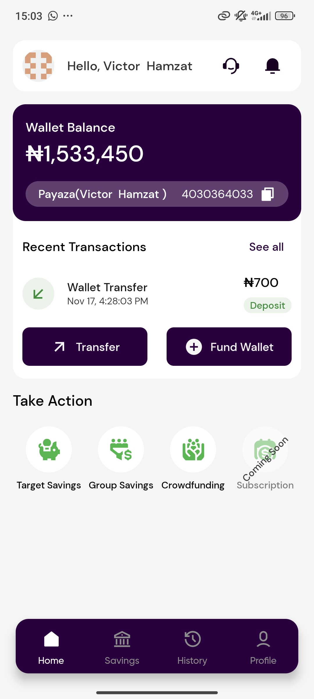
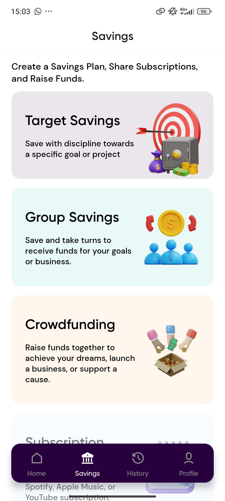
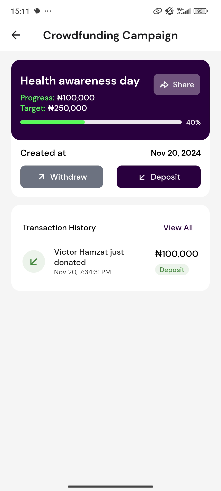

# SaveHaven: Saving, Supporting, and Growing Together 🚀

SaveHaven is here to tackle a challenge many Africans faced in managing finances in a way that feels secure, simple, and connected. We’re combining personal savings, group savings, and crowdfunding into one easy-to-use platform designed specifically for people in Africa, starting with Nigeria.  

<p>
  
  
  
</p>
> Built with [Expo](https://expo.dev/)

## 📋 Table of Content

- [🚀 Project Structure](#-project-structure)
- [📦 Packages Used](#-packages-used)
- [🧞 Commands](#-commands)
- [🤝 Contributing](#-contributing)

## 🚀 Project Structure

Inside repository, you'll see the following folders and files:

```text
├───.tamagui
├───.vscode
├───app
├───patches*
└───src
    ├───assets
    │   ├───bootsplash
    │   ├───fonts
    │   ├───icons
    │   └───images
    ├───components
    │   └───base
    ├───constants
    ├───data
    ├───hooks
    ├───i18n*
    ├───layouts
    ├───schemas*
    ├───store
    ├───types
    ├───utils
    └───screens

* to be added
```

- `app` This is where you can find all the routes present in the app. This project uses [Expo Router](https://docs.expo.dev/router/introduction/), it's a file based router that allows seamless navigation between screens. It offers some special features like Optimizations(lazy loading etc), Easy and custom Layout management,type-saf routes and more.

- `patches` This is where you can find all the patches that are applied to the project. This project uses [patch-package](https://github.com/ds300/patch-package)
- `src/assets` This is where you can find all the static assets like images, icons and fonts. This project makes use of [react-native-svg-transformer](https://github.com/kristerkari/react-native-svg-transformer), which allows importing of SVGs as React components with Optimzation steps by [SVGO](https://github.com/svg/svgo). This project also uses Expo fonts, which allows you to load fonts from the web and local files and Expo Image for image optimization.

- `src/components` directory for all our components. It is has 2 subfolders, `base` and `inc`. `base` contains all the base components that are used across multiple screens(e.g Input, Buttons, Text) and `inc` contains all the components that are used only in a single screen. This project uses [Tamagui](http://tamagui.com/) and it's primitives for styling and creating components.

- `src/constants` directory for all our constants.

- `src/data` directory for all our data(e.g slides, products, etc).

- `src/hooks` directory for all our custom hooks.

- `src/i18n` directory for all our internationalization setup. This project uses [i18next](https://www.i18next.com/) for internationalization.

- `src/layouts` directory for all our layout components. Layouts are special components that wrap other components, and are used to create a consistent layout across multiple screens. As we use Expo Router, you can read the documentation [here](https://docs.expo.dev/router/layouts/).

- `src/schemas` directory for all our zod schemas.

- `src/store` directory for all our store setup. This project uses [Zustand](https://docs.pmnd.rs/zustand/getting-started/introduction) for state management.

- `src/types` directory for all our types.

- `src/utils` directory for all our utility functions.

- `src/screens` directory for all our screens. Each screen is exported and consumed in their corresponding routes in the `app` folder.

## 📦 Packages Used

- [Expo](https://expo.dev/): A free and open-source platform for making universal native apps for Android, iOS, and the web with JavaScript and React.
- [Tamagui](https://tamagui.dev/): A powerful crossplatform design and style system for React Native.
- [Expo Router](https://docs.expo.dev/router/introduction/): A file based router that allows seamless navigation between screens.
- [reanimated](https://docs.swmansion.com/react-native-reanimated/docs/): React Native's Animated library reimplemented for speed,performance and ease of use.
- [FlashList](https://shopify.github.io/flash-list/docs/): A fast & performant React Native list. No more blank cells.
- [Burnt](https://github.com/nandorojo/burnt): Cross-platform toasts for React Native, powered by native elements.
- [React Query](https://tanstack.com/query/latest/docs/framework/react/overview): A powerful library for managing, caching, and syncing server state in React applications.
- [React query kit](https://github.com/HuolalaTech/react-query-kit): A toolkit for ReactQuery that make ReactQuery hooks reusable and typesafe
- [React Hook Form](https://react-hook-form.com/): Performant, flexible and extensible forms with easy-to-use validation.
- [zod](https://zodjs.netlify.app/): A TypeScript-first schema declaration and validation library.
- [i18next](https://www.i18next.com/): Internationalization framework for browser or any other javascript environment.
- [Zustand](https://docs.pmnd.rs/zustand/getting-started/introduction): A small, fast and scaleable bearbones state-management solution.
- [MMKV](https://github.com/mrousavy/react-native-mmkv): A blazingly fast™️⚡(~30x faster than AsyncStorage), small, and secure key-value storage library for React Native.
- [react-native-svg-transformer](https://github.com/kristerkari/react-native-svg-transformer): Allows importing SVG files in your React Native project the same way that you would in a Web project - using the svg component.

## 🧞 Commands

All commands are run from the root of the project, from a terminal:

| Command                   | Action                                                                                             |
| :------------------------ | :------------------------------------------------------------------------------------------------- |
| `npm install`             | Installs dependencies                                                                              |
| `npm run start`           | Starts the expo development server                                                                 |
| `npm run android`         | Starts the app on the android platform                                                             |
| `npm run ios`             | Starts the app in the ios platform                                                                 |
| `npm run web`             | Starts the app in the web platform                                                                 |
| `npm run build:<profile>` | Creats a build on EAS based on the the profile. Supported profiles `dev`, `preview`, and `production`  |

## 🤝 Contributing

We welcome contributions from anyone who is interested in this project. Here are some guidelines on how to contribute:

1. Fork this repository and clone it to your local machine.
2. Create a new branch from the main branch, following the naming convention `feature/<your-feature-name>` or `fix/<your-bug-name>`.
3. Make your changes and commit them with a clear and descriptive message, following the Conventional Commits [specification](https://www.conventionalcommits.org/en/).
4. Push your branch to your forked repository and create a pull request to the main branch of this repository.
5. Wait for the code review and feedback from the maintainers.

> [!INFO]  
>To generate a Splash screen, use this command
>
>```bash npx react-native generate-bootsplash ./src/assets/images/icon.svg --background=#ffffff --platforms=android,ios --assets-output=./src/assets/bootsplash```
